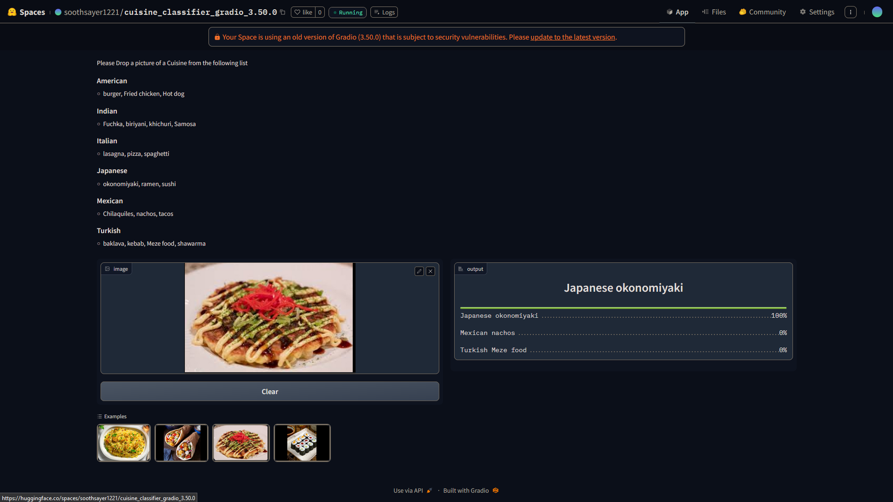

# 🍽 Cuisine Classifier

From a list of countries and their popular cuisines , this project can detect them , powered by Resnet50 

Cuisines the model can clasify 

| **Cuisine**  | **Popular Dishes**                            |
|--------------|-----------------------------------------------|
| **🇯🇵 Japanese** | Okonomiyaki, Ramen, Sushi                   |
| **🇲🇽 Mexican**  | Chilaquiles, Nachos, Tacos                  |
| **🇹🇷 Turkish**  | Baklava, Kebab, Meze food, Shawarma         |
| **🇺🇸 American** | Burger, Fried Chicken, Hot Dog              |
| **🇮🇳 Indian**   | Fuchka, Biriyani, Khichuri, Samosa          |
| **🇮🇹 Italian**  | Lasagna, Pizza, Spaghetti                   |

Check out the web app [Cuisine Classifier]( arian-rahman.github.io/cuisen_identifier/ )
 
## 📊 Dataset Preparation

- **Data Collection**: Images were gathered using DuckDuckGo and organized into a dynamically generated folder structure. 
- **DataLoader**: Leveraged the `fastai` DataBlock API to create an efficient DataLoader for the model.
- **Data Augmentation**: Applied GPU-based default data augmentation provided by `fastai`, optimizing training performance.

➡️ For more details, refer to the notebook: `Food_Classifier_Data_cleaning_to_Model_train.ipynb`.

---

## 🏋️‍♂️ Training and Data Cleaning

- **Model**: Fine-tuned a ResNet50 model on the dataset.
- **Performance**: Achieved over **90% accuracy** after 7 epochs of training.

---

## 🚀 Model Deployment

- **Deployment**: The trained model was deployed on HuggingFace Spaces using a Gradio interface.
- **Link**: Check out the deployed app [here](https://huggingface.co/spaces/soothsayer1221/cuisine_classifier_gradio_3.50.0). 
- **Example UI**:

  

---

## 🌐 API Integration with GitHub Pages

- The model’s API is integrated into a GitHub Pages site. Explore the live classifier [here](https://arian-rahman.github.io/cuisen_identifier/).
- The necessary files for GitHub Pages can be found in the repository under the main branch.

